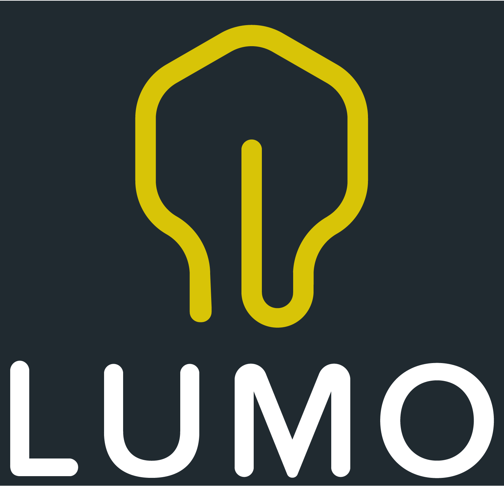

# Lumo
[](#backers)
[](#sponsors)

Lumo is a standalone ClojureScript environment that runs on Node.js and the V8
JavaScript engine. It starts up instantaneously and provides out-of-the-box access to
the entire Node.js ecosystem, including a ClojureScript REPL.

Lumo also provides a ClojureScript build API, making it possible to
[compile ClojureScript projects entirely without the JVM](https://anmonteiro.com/2017/02/compiling-clojurescript-projects-without-the-jvm/),
thanks to the [experimental JavaScript version](https://github.com/google/closure-compiler-js)
of the [Google Closure Compiler](https://github.com/google/closure-compiler).

Read the [announcement blog post](https://anmonteiro.com/2016/11/the-fastest-clojure-repl-in-the-world/)
and our [pledge](https://anmonteiro.com/2017/05/on-lumos-growth-and-sustainability/)!

If you enjoy Lumo, consider backing or sponsoring the project on
<a href="https://opencollective.com/lumo">
  
</a>

## Build status

| Platform  | Status   |
| --------- | ---------|
| macOS     | [](https://circleci.com/gh/anmonteiro/lumo) |
| Linux     | [](https://travis-ci.org/anmonteiro/lumo) |
| Windows   | [](https://ci.appveyor.com/project/anmonteiro/lumo) |

## Contents

- [Installation](#installation)
- [Using Lumo](#using-lumo)
- [Building](#building)
- [Backers](#backers)
- [Sponsors](#sponsors)
- [Copyright & License](#copyright--license)

## Installation

### Via [NPX](https://blog.npmjs.org/post/162869356040/introducing-npx-an-npm-package-runner)

npx is a package runner that comes with node6+. You can try lumo "without install" with:

```shell
npx -p lumo-cljs lumo
```

### Via [NPM](https://www.npmjs.com/package/lumo-cljs)

```shell
$ npm install -g lumo-cljs
```

If you get a [permission failure](https://github.com/anmonteiro/lumo/issues/206), try this:

```
$ npm install -g lumo-cljs --unsafe-perm
```

_Note: the installed binary will be named `lumo` rather than `lumo-cljs`_

### Via [Homebrew](http://brew.sh/) (macOS)

```shell
$ brew install lumo
```

**Note:** If you want to install a binary built from master, run `brew install --HEAD lumo`
(at your own responsibility).

### [Docker](https://store.docker.com/community/images/anmonteiro/lumo)

``` shell
$ docker pull anmonteiro/lumo:latest
$ docker run -it anmonteiro/lumo
```

### Manual

1. Download the [latest release](https://github.com/anmonteiro/lumo/releases/latest).
2. Move it to somewhere in your `$PATH`.

## Using Lumo

### Interactive ClojureScript REPL

Enter `lumo` at the command line to launch the ClojureScript REPL.

```clojure
$ npm init -y && npm install express request request-promise
$ lumo
Lumo 1.10.1
ClojureScript 1.10.520
...
cljs.user=> (require 'express)
cljs.user=> (require '[request-promise :as rp])
cljs.user=> (def port 3000)
#'cljs.user/port
cljs.user=> (-> (express)
       #_=>     (.get "/" (fn [req res] (.send res "Hello Lumo")))
       #_=>     (.listen port))
#object[Server [object Object]]
cljs.user=> (-> (str "http://localhost:" port)
       #_=>     rp
       #_=>     (.then (fn [body] (println "\nReceived:" body)))
       #_=>     (.catch (fn [err] (println "\nOops:" (.-stack err)))))
#object[Promise [object Promise]]
Received: Hello Lumo
```

Check out `lumo -h` for usage instructions and supported command line options.
Also, see the [announcement blog post](https://anmonteiro.com/2016/11/the-fastest-clojure-repl-in-the-world/).

### Compile ClojureScript

Lumo can compile ClojureScript code as of version `1.2.0`. See the introductory
[blog post](https://anmonteiro.com/2017/02/compiling-clojurescript-projects-without-the-jvm/).
It is still considered experimental, given the relatively new Google Closure
Compiler [port](https://github.com/google/closure-compiler-js) to JavaScript,
but it aims to be at feature parity with the JVM ClojureScript compiler.

The build API mirrors the ClojureScript one. Please reference its
[Quick Start](https://clojurescript.org/guides/quick-start) and the
[Compiler Options](https://clojurescript.org/reference/compiler-options).  You
can basically just replace the namespace with `lumo.build.api`:

```clojure
(require 'lumo.build.api)

(lumo.build.api/build "src" {:output-to "out/main.js"})
```

The following example also shows how to use multiple source folders.

```clojure
(require '[lumo.build.api :as b])

(b/build
 (b/inputs "src1" "src2") ;; variadic
 {:output-to "out/main.js"})
 ```

## Building

To build Lumo from source:

1. Make sure you have installed [Boot](http://boot-clj.com/), [Yarn](https://yarnpkg.com/) and [Node.js](https://nodejs.org/en/download/current/) (version >= 8).
2. At the root of the repository, run: `boot release`.
3. The resulting binary can be found in `build/lumo` (or `build\lumo.exe` if you're
on Windows).

## Contributing

See [CONTRIBUTING.md](./CONTRIBUTING.md).

## Backers

Support us with a monthly donation and help us continue our activities. [[Become a backer](https://opencollective.com/lumo#backer)]

<a href="https://opencollective.com/lumo/backer/0/website" target="_blank"></a>
<a href="https://opencollective.com/lumo/backer/1/website" target="_blank"></a>
<a href="https://opencollective.com/lumo/backer/2/website" target="_blank"></a>
<a href="https://opencollective.com/lumo/backer/3/website" target="_blank"></a>
<a href="https://opencollective.com/lumo/backer/4/website" target="_blank"></a>
<a href="https://opencollective.com/lumo/backer/5/website" target="_blank"></a>
<a href="https://opencollective.com/lumo/backer/6/website" target="_blank"></a>
<a href="https://opencollective.com/lumo/backer/7/website" target="_blank"></a>
<a href="https://opencollective.com/lumo/backer/8/website" target="_blank"></a>
<a href="https://opencollective.com/lumo/backer/9/website" target="_blank"></a>
<a href="https://opencollective.com/lumo/backer/10/website" target="_blank"></a>
<a href="https://opencollective.com/lumo/backer/11/website" target="_blank"></a>
<a href="https://opencollective.com/lumo/backer/12/website" target="_blank"></a>
<a href="https://opencollective.com/lumo/backer/13/website" target="_blank"></a>
<a href="https://opencollective.com/lumo/backer/14/website" target="_blank"></a>
<a href="https://opencollective.com/lumo/backer/15/website" target="_blank"></a>
<a href="https://opencollective.com/lumo/backer/16/website" target="_blank"></a>
<a href="https://opencollective.com/lumo/backer/17/website" target="_blank"></a>
<a href="https://opencollective.com/lumo/backer/18/website" target="_blank"></a>
<a href="https://opencollective.com/lumo/backer/19/website" target="_blank"></a>
<a href="https://opencollective.com/lumo/backer/20/website" target="_blank"></a>
<a href="https://opencollective.com/lumo/backer/21/website" target="_blank"></a>
<a href="https://opencollective.com/lumo/backer/22/website" target="_blank"></a>
<a href="https://opencollective.com/lumo/backer/23/website" target="_blank"></a>
<a href="https://opencollective.com/lumo/backer/24/website" target="_blank"></a>
<a href="https://opencollective.com/lumo/backer/25/website" target="_blank"></a>
<a href="https://opencollective.com/lumo/backer/26/website" target="_blank"></a>
<a href="https://opencollective.com/lumo/backer/27/website" target="_blank"></a>
<a href="https://opencollective.com/lumo/backer/28/website" target="_blank"></a>
<a href="https://opencollective.com/lumo/backer/29/website" target="_blank"></a>


## Sponsors

Become a sponsor and get your logo on our README on Github with a link to your site. [[Become a sponsor](https://opencollective.com/lumo#sponsor)]

<a href="https://opencollective.com/lumo/sponsor/0/website" target="_blank"></a>
<a href="https://opencollective.com/lumo/sponsor/1/website" target="_blank"></a>
<a href="https://opencollective.com/lumo/sponsor/2/website" target="_blank"></a>
<a href="https://opencollective.com/lumo/sponsor/3/website" target="_blank"></a>
<a href="https://opencollective.com/lumo/sponsor/4/website" target="_blank"></a>
<a href="https://opencollective.com/lumo/sponsor/5/website" target="_blank"></a>
<a href="https://opencollective.com/lumo/sponsor/6/website" target="_blank"></a>
<a href="https://opencollective.com/lumo/sponsor/7/website" target="_blank"></a>
<a href="https://opencollective.com/lumo/sponsor/8/website" target="_blank"></a>
<a href="https://opencollective.com/lumo/sponsor/9/website" target="_blank"></a>
<a href="https://opencollective.com/lumo/sponsor/10/website" target="_blank"></a>
<a href="https://opencollective.com/lumo/sponsor/11/website" target="_blank"></a>
<a href="https://opencollective.com/lumo/sponsor/12/website" target="_blank"></a>
<a href="https://opencollective.com/lumo/sponsor/13/website" target="_blank"></a>
<a href="https://opencollective.com/lumo/sponsor/14/website" target="_blank"></a>
<a href="https://opencollective.com/lumo/sponsor/15/website" target="_blank"></a>
<a href="https://opencollective.com/lumo/sponsor/16/website" target="_blank"></a>
<a href="https://opencollective.com/lumo/sponsor/17/website" target="_blank"></a>
<a href="https://opencollective.com/lumo/sponsor/18/website" target="_blank"></a>
<a href="https://opencollective.com/lumo/sponsor/19/website" target="_blank"></a>
<a href="https://opencollective.com/lumo/sponsor/20/website" target="_blank"></a>
<a href="https://opencollective.com/lumo/sponsor/21/website" target="_blank"></a>
<a href="https://opencollective.com/lumo/sponsor/22/website" target="_blank"></a>
<a href="https://opencollective.com/lumo/sponsor/23/website" target="_blank"></a>
<a href="https://opencollective.com/lumo/sponsor/24/website" target="_blank"></a>
<a href="https://opencollective.com/lumo/sponsor/25/website" target="_blank"></a>
<a href="https://opencollective.com/lumo/sponsor/26/website" target="_blank"></a>
<a href="https://opencollective.com/lumo/sponsor/27/website" target="_blank"></a>
<a href="https://opencollective.com/lumo/sponsor/28/website" target="_blank"></a>
<a href="https://opencollective.com/lumo/sponsor/29/website" target="_blank"></a>


## Copyright & License

Copyright © 2016-2017 António Nuno Monteiro

Distributed under the Eclipse Public License (see [LICENSE](./LICENSE)).
